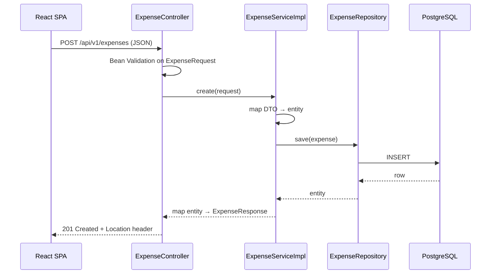

# Architecture

## Overview

The project is a monorepo with two independently deployable halves:

- **`backend/`** — a Spring Boot 3.5 REST API (Java 21) exposing `/api/v1/expenses`.
- **`frontend/`** — a React 18 SPA (Vite + TypeScript + Tailwind) consuming that API.

They communicate only over HTTP/JSON, so each half can be developed, tested, and deployed
in isolation (Render for the API, Vercel for the SPA).

## Backend: layered architecture

```
Controller  →  Service (interface + impl)  →  Repository  →  PostgreSQL / H2
   DTOs            business rules              JPA entity
```

- **Controller** (`controller/`) — HTTP concerns only: request parsing, validation trigger,
  status codes, `Location` headers. Controllers never see JPA entities; they work purely
  with DTOs.
- **Service** (`service/` + `service/impl/`) — business logic behind an interface
  (`ExpenseService`), which keeps controllers testable with mocks and leaves room for
  alternative implementations (caching, auditing decorators, …).
- **Repository** (`repository/`) — Spring Data JPA interface plus JPA `Specification`
  helpers for month/category filtering and a projection query for category totals.
- **Mapper** (`mapper/`) — a small hand-written mapper converting between the `Expense`
  entity and request/response records. No MapStruct needed at this size.
- **Exception handling** (`exception/`) — a `@RestControllerAdvice` translates exceptions
  into one consistent error JSON: `{ timestamp, status, error, message, path, fieldErrors? }`.

### Request flow



### Why DTOs and a mapper?

- **API stability** — the wire format is decoupled from the persistence model. Renaming a
  column or adding an internal field never silently changes the JSON contract.
- **Security** — no accidental exposure of internal fields, and no mass-assignment risk on
  writes (a client can only send the fields `ExpenseRequest` declares).
- **Validation belongs to input** — Jakarta Bean Validation annotations live on the request
  record, not the entity.
- Java records make DTOs nearly free: immutable, `equals`/`hashCode`, no boilerplate.

### Profile strategy

| Profile | Database                | Where it runs                    |
| ------- | ----------------------- | -------------------------------- |
| `dev`   | H2 in-memory            | local development (default)      |
| `test`  | Testcontainers Postgres | integration tests (needs Docker) |
| `prod`  | PostgreSQL via env vars | Render                           |

The schema is owned by **Flyway** (`db/migration/V1__init.sql`) and Hibernate runs with
`ddl-auto: validate`, so all three environments share the exact same DDL. Production
credentials come exclusively from environment variables (`DATABASE_URL`, `DB_USER`,
`DB_PASSWORD`) — nothing sensitive is in the repo.

## Frontend

- **`src/api/`** — a single axios instance (base URL from `VITE_API_BASE_URL`) plus typed
  functions per endpoint. Components never call axios directly.
- **`src/hooks/`** — TanStack Query hooks wrap the API functions; mutations invalidate the
  `['expenses']` key family so tables and summaries refetch automatically.
- **`src/types/`** — TypeScript mirrors of the backend DTOs, including the Spring Data
  page shape and the error body (used to surface backend field errors in forms).
- **`src/pages/`** — `DashboardPage` (monthly summary cards + Recharts pie) and
  `ExpensesPage` (filterable, paginated table with an add/edit modal).
- **Validation** — the form mirrors the backend rules client-side and, if the backend
  still rejects the payload, maps `fieldErrors` from the error JSON onto the form fields.

## CI

Two path-filtered GitHub Actions workflows keep monorepo builds fast: `backend-ci.yml`
(`./gradlew build`, Temurin 21, Gradle cache) runs only when `backend/**` changes;
`frontend-ci.yml` (`npm ci && npm run lint && npm run build`, Node 20) only for
`frontend/**`. Integration tests run against a real PostgreSQL via Testcontainers on the
CI runner's Docker daemon.
